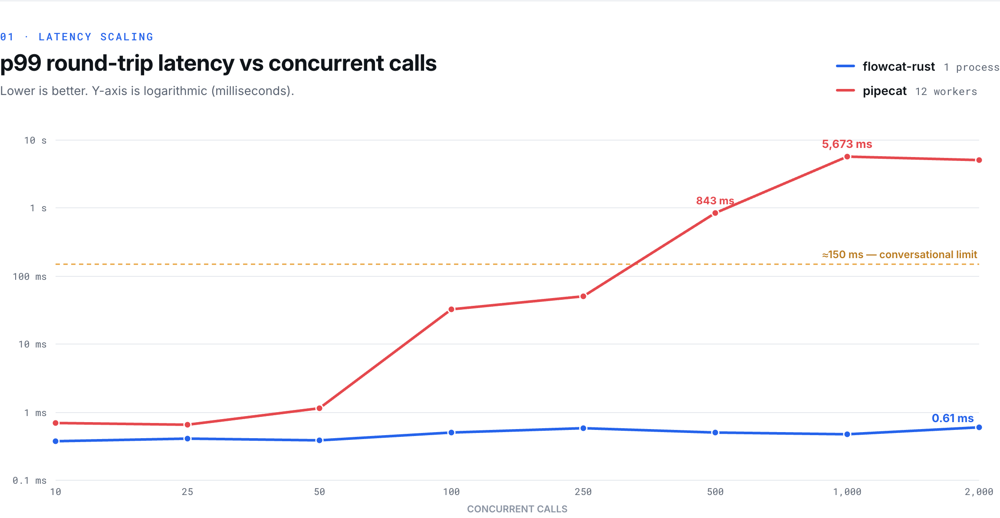
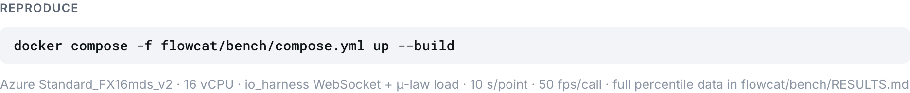

<!-- SPDX-License-Identifier: Apache-2.0 -->
# Flowcat

**A native-Rust runtime for real-time voice agents — built to run on your own
infrastructure.** Flowcat carries a phone or WebRTC call through a composable
media pipeline — transport in → VAD / turn-taking → STT · LLM · TTS (or a single
speech-to-speech model) → transport out — as **one self-contained binary you
deploy in your own VPC** (or fully air-gapped). No hosted control plane, no
phone-home, no Python or FreeSWITCH sidecar to operate. You bring your own
provider credentials; a call's audio and data never leave infrastructure you
control.

It is a clean-room, native-Rust counterpart to the design of
[pipecat](https://github.com/pipecat-ai/pipecat): the same `FrameProcessor`
pipeline model and the same provider breadth, packaged for teams that need to
**own the stack** — self-hosted, auditable, and dense enough to run serious call
volume per box. No pipecat code is vendored — see [`NOTICE`](NOTICE).

**License:** Apache-2.0 ([`LICENSE`](LICENSE)) · **Status:** pre-1.0, building in
the open.

> **New here?** → **[`QUICKSTART.md`](QUICKSTART.md)** takes you from `git clone` to
> a running pipeline, a real WebSocket audio round-trip, and a Python-driven brain
> in about five minutes — no credentials.

---

## Why Flowcat

Most voice-agent platforms are hosted SaaS: your audio, transcripts, and call
data flow through someone else's cloud, and you pay per minute. Flowcat is the
opposite — **a runtime you own and run yourself**, for teams that can't or won't
put regulated call traffic on a multi-tenant platform and want one auditable
artifact instead of a fleet of services.

### 1. Own your voice stack

Flowcat is a single self-contained binary you deploy in your own VPC — or fully
air-gapped. There is **no Flowcat cloud and no phone-home**: the runtime reads
only its own `FLOWCAT_*` config and talks to the providers *you* configure with
*your* credentials. Pair it with the local STT/TTS/LLM connectors (Whisper,
Kokoro / Piper / XTTS, Ollama) and a call's audio and transcript never leave your
infrastructure. For data-residency, on-prem, and sovereignty requirements
(healthcare, finance, public sector), that's the deployment model itself — not a
checkbox bolted onto a SaaS.

### 2. pipecat-compatible by design

If you know [pipecat](https://github.com/pipecat-ai/pipecat), you already know
Flowcat. It deliberately mirrors pipecat's architecture and public API model —
the `FrameProcessor` graph, the typed `Frame` taxonomy, the system-frame
priority / interruption model, and the STT/TTS/LLM/realtime service seams. You
bring the same mental model and the **same vendor credentials**; you get a single
static Rust binary instead of a Python process tree. See
[Connectors & providers](#connectors--providers).

### 3. One process, room to scale

Because the media loop is Rust — no garbage collector, no GIL — one Flowcat
process uses every core and holds a **flat p99 from 10 to 2,000 concurrent calls
on a single box**, where an equivalent Python deployment grows a multi-second
tail and needs a worker fleet. Read this as **capacity and operational headroom**,
not as a claim about conversational latency: end-to-end voice latency is
dominated by your STT/LLM/TTS providers (hundreds of ms) and Flowcat can't change
that. What it guarantees is that *the runtime itself* never becomes the
bottleneck or the source of a stall — so you provision fewer boxes and your tail
stays predictable under load. See [Benchmark & capacity](#benchmark--capacity).

### 4. Drive it from Python

You don't have to write Rust. Run Flowcat as a service and drive it from Python
at **turn granularity**: implement your conversation policy as a small HTTP
service (the `RemoteBrain` adapter, `brain-http` feature) and expose your Python
functions as tools over MCP. Your code never touches the per-frame path, so the
capacity profile above is preserved. In-process **PyO3 bindings** are on the
[roadmap](ROADMAP.md). See [Using Flowcat from Python](#using-flowcat-from-python)
and [`examples/`](examples/).

---

## Benchmark & capacity

**What this measures:** how much call volume one box absorbs before the *runtime*
becomes the bottleneck, and how tight the tail stays under load. **What it does
not measure:** end-to-end conversational latency — that's dominated by your
STT/LLM/TTS providers (typically hundreds of ms), and Flowcat doesn't change it.
Read the sub-millisecond figures below as framework/transport overhead — capacity
and reliability headroom — not as the latency a caller hears.

A like-for-like benchmark on a single Azure `Standard_FX16mds_v2` box (16 vCPU):
one Flowcat process (12 cores) vs pipecat in its **real multiprocess
deployment** (12 workers, `SO_REUSEPORT`, one per core — Python given every
advantage). Identical Rust WebSocket + μ-law load generator, full-duplex echo,
50 frames/s/call, 10 s per data point.

### p99 round-trip latency vs concurrent calls



Flowcat's line is flat along the floor; pipecat crosses the ~150 ms
conversational limit at a few hundred calls and reaches multi-second tails by
1,000.

| Concurrent calls | Flowcat (1 process) | pipecat (12 workers) |
| --- | --- | --- |
| 250  | **0.59 ms** p99 | 51 ms p99 |
| 500  | **0.51 ms** p99 | 843 ms p99 |
| 1000 | **0.47 ms** p99 | 5,673 ms p99 · 77% throughput |
| 2000 | **0.61 ms** p99 | failing · 41% throughput (982 conns refused) |

### Other measured metrics

| Metric | Flowcat (Rust) | pipecat (Python) | Ratio |
| --- | --- | --- | --- |
| Worst-case p99, 10→2,000 calls | **0.61 ms** | 5,673 ms | — |
| Tail at 500 calls (matched load) | **0.51 ms** | 843 ms | **~1,650× lower** |
| Sustained throughput | **100%** to 2,000 calls | collapses past ~250 | — |
| Per-frame routing (framework floor) | **~0.20 µs** | ~106 µs | ~525× |
| RAM per idle session | **~19.6 KB** | ≤ ~1 MB | ~50× tighter |
| Tasks per session | 7 tokio | 22 asyncio | — |
| Multi-core scaling (1→14 cores) | **8.4×** (no GIL) | n/a (1 core/process) | — |

Full percentile distributions (p50 / p90 / p99 / p99.9 / max), the methodology,
and the phase history are in **[`bench/RESULTS.md`](bench/RESULTS.md)**.

### Reproduce it



```bash
docker compose -f bench/compose.yml up --build   # on a 16-vCPU VM
```

See [`bench/README.md`](bench/README.md) for the full harness and SKU notes.

> **Disclaimer.** Numbers above are from the reproducible kit in this repo on the
> stated hardware; your results will vary with hardware and configuration.
> pipecat is an independent open-source project; it is used here as an
> architecture reference and a benchmark baseline. Flowcat is **not affiliated
> with, sponsored by, or endorsed by Daily or the pipecat project**. "pipecat" is
> referenced for identification and comparison only; all marks belong to their
> respective owners. See [`NOTICE`](NOTICE).

---

## How to use it

Flowcat is a Cargo workspace of four library crates plus a demo binary. Nothing
networked is in the default build — every provider, transport, and exporter is
an opt-in Cargo feature.

```bash
# Build the whole workspace (default features only → no provider client deps).
cargo build

# Run the full fixture/wire test suite (no network, no credentials).
cargo test

# Build a "fat" binary that pulls in every provider client:
cargo build -p flowcat-services \
  --features stt-all,tts-all,llm-all,realtime-all,obs-all

# The demo binary — two runnable, credential-free demos:
cargo run -p flowcat-cli -- pipeline           # in-process FrameProcessor pipeline
cargo run -p flowcat-cli -- ws-echo --loopback # real WebSocket PCM echo round-trip
```

Embedding Flowcat in your own service, in three seams you implement:

- **`FrameProcessor` pipeline** — compose `transport.input() → vad → stt → llm →
  tts → transport.output()` (or a single realtime S2S model) into a `Pipeline`,
  drive it with a `PipelineTask` / `PipelineRunner`. Each processor runs in its
  own tokio task behind a bounded channel (natural backpressure).
- **`AgentBrain`** — your conversation decision-making. Flowcat never sees your
  control-plane, REST contract, or database; the brain is a trait seam. (Don't
  want to write Rust? The ready-made `RemoteBrain` adapter implements this seam
  against an HTTP service — see [Using Flowcat from Python](#using-flowcat-from-python).)
- **`SessionSource`** — how a call is bootstrapped and finalized.

The runtime is **provider- and contract-agnostic**: it knows nothing about any
downstream control plane. Full processor-author contract:
[`PROCESSOR-DESIGN.md`](PROCESSOR-DESIGN.md) and
[`CONTRIBUTING.md`](CONTRIBUTING.md).

### Feature-flag model

`flowcat-core` defaults to `["sip", "recorder"]` (no HTTP/gRPC/ONNX). Every
provider, transport, and exporter is `dep:`-gated, so adding the 80th provider
costs the default build nothing. Umbrella features (`stt-all`, `tts-all`,
`llm-all`, `realtime-all`, `obs-all`) exist for the CLI and CI. Full enumeration:
[`FEATURES.md`](FEATURES.md).

> The `flowcat` CLI ships two demos (the analogue of pipecat's `examples/`), both
> credential-free and exercised in CI: **`pipeline`** drives a synthetic
> sine-wave source through a composable `FrameProcessor` pipeline in-process, and
> **`ws-echo`** echoes PCM over the real WebSocket transport (`--loopback` for a
> self-contained round-trip, or `--connect <ws://url>` to a live peer). See
> [`flowcat-cli/src/`](flowcat-cli/src/).

---

## Using Flowcat from Python

Flowcat is a Rust runtime, but you don't have to write Rust to use it. The media
loop (SIP/RTP, VAD, STT/LLM/TTS) runs in Rust; your Python runs at **turn
granularity** over a network boundary, so it never sits on the per-audio-frame
path that determines tail latency.

- **Drive the conversation policy** — the `RemoteBrain` adapter
  (`flowcat-services`, feature `brain-http`) implements the `AgentBrain` seam by
  POSTing to two JSON endpoints you host. Decide transitions, what to say, and
  when to end the call — in Python. Reference server + wire contract:
  [`examples/python-remote-brain`](examples/python-remote-brain).
- **Expose Python functions as tools** — run an MCP server; Flowcat's `mcp`
  client lists and calls its tools.
  [`examples/python-mcp-tools`](examples/python-mcp-tools).

In-process **PyO3 bindings** — `import flowcat`, build a pipeline in Python, pass
Python callables as the brain — are on the [roadmap](ROADMAP.md); they will keep
Python at turn granularity to preserve the same tail-latency guarantees.

## Connectors & providers

**Start here: the live-verified path.** The **Gemini Live + Plivo** combination
— speech-to-speech over WebSocket-media telephony — is the one path run
end-to-end against the real services today. Build on it first, and treat
everything below as wire-ready but unproven until you run it yourself.

Beyond that, Flowcat carries a broad provider catalogue, each connector **one
`dep:`-gated Cargo feature** so the default build pulls none of their client
dependencies:

| Category | Count | Examples |
| --- | --- | --- |
| **STT** | 20 | Deepgram, AssemblyAI, Gladia, Cartesia, Azure, ElevenLabs, OpenAI/Whisper (+ Groq/Fal/xAI wrappers), Google/NVIDIA (gRPC), AWS Transcribe (SigV4), local Whisper |
| **TTS** | 29 | Cartesia, ElevenLabs, Deepgram, Rime, OpenAI (+ Groq/xAI), Azure, Hume, MiniMax, Fish, LMNT, Kokoro/Piper/XTTS (local), Google/NVIDIA (gRPC), AWS Polly (SigV4) |
| **LLM** | 23 | OpenAI (+ ~18 OpenAI-compatible wrappers: Groq, Together, Fireworks, OpenRouter, DeepSeek, …), Anthropic, Google Gemini, AWS Bedrock (SigV4) |
| **Realtime (S2S)** | 7 | Gemini Live (in core), OpenAI Realtime (+ Azure/Grok/Inworld), Ultravox, AWS Nova Sonic |
| **Transports** | 5 | `str0m` WebRTC (+ Opus), WebSocket, Daily, LiveKit, local mic/speaker |
| **Telephony serializers** | 9 | Twilio, Telnyx, Plivo, Exotel, Vonage, Genesys, Asterisk, Cloudonix, Vobiz + DTMF (RFC2833 + in-band Goertzel) |
| **Observability** | 3 | OpenTelemetry, Sentry, Langfuse exporters |

The full feature-flag matrix is in [`FEATURES.md`](FEATURES.md); how the distinct
(D) clients and thin (W) wrappers relate is in
[`PROVIDERS.md`](PROVIDERS.md).

> **What "supported" means here — read this before you count providers.** Every
> connector is **fixture/wire-tested**: unit tests pin its message framing (plus
> SigV4 known-answer tests for the AWS path), so the encode/decode seam is
> correct. They are **not** all exercised against the live service in CI — an
> end-to-end call needs that vendor's credentials. Today the **Gemini Live +
> Plivo/Zadarma** path is confirmed live end-to-end; the rest are a short step
> away but unproven until you run them. Live-verifying a provider against its real
> service is one of the most useful contributions you can make — see
> [`CONTRIBUTING.md`](CONTRIBUTING.md).

---

## How it works

```
 carrier / WebRTC          FrameProcessor graph (each stage = 1 tokio task)
 ───────────────►  ┌──────────────────────────────────────────────────┐
   SIP / RTP       │  transport.in → vad/turn → stt → llm → tts → out  │
   WebSocket       │                    └──── or realtime S2S ────┘     │
 ◄───────────────  └──────────────────────────────────────────────────┘
                      system frames (Start/Cancel/Interruption/End)
                      jump the queue on a priority channel
```

- **Typed `Frame` taxonomy** (audio / text / control / system). The hot audio
  frame is an `Arc<AudioFrame>`, so each hop moves a pointer, not a buffer.
- **Each processor runs in its own tokio task** fed by a bounded mpsc channel,
  giving natural backpressure on the output media leg. The per-hop channel cost
  is ~0.029 µs — three orders of magnitude under the audio frame period.
- **System frames jump the queue.** `Start` / `Cancel` / `Interruption` / `End` /
  `Stop` ride an unbounded priority channel and invoke a processor's
  `start()` / `stop()` lifecycle hooks, bypassing `process_frame`.
- **Native SIP/RTP, in-process — softswitch optional.** `flowcat-core` speaks SIP
  (REGISTER + digest auth, INVITE/ACK/BYE) and hand-rolled RTP/SDP for G.711
  telephony directly, so a single binary can terminate calls with no
  FreeSWITCH/Asterisk at all. That's a *deployment choice, not a mandate* — if you
  already run a softswitch, keep it in front and feed audio over the WebSocket
  media transport. ([`SIP-DESIGN.md`](SIP-DESIGN.md).)

Design details: [`PROCESSOR-DESIGN.md`](PROCESSOR-DESIGN.md) (frozen API +
latency argument) and [`DESIGN.md`](DESIGN.md) (runtime architecture + trait
seams).

## Crate map

```
flowcat/
├── flowcat-core/        # framework: Frame, FrameProcessor, Pipeline/Task/Runner,
│                        #   Observer/metrics, audio codec/resample/recorder,
│                        #   native SIP/RTP/SDP UA, Gemini Live, all trait seams
├── flowcat-services/    # every STT/TTS/LLM/realtime provider + obs exporters + MCP
│                        #   — one cargo feature each
├── flowcat-transports/  # str0m WebRTC + Opus, WebSocket, Daily, LiveKit, local
├── flowcat-telephony/   # carrier FrameSerializers (Twilio/Telnyx/Plivo/…) + DTMF
├── flowcat-cli/         # `flowcat` demo binary (DX / examples surface)
├── bench/               # the reproducible pipecat-vs-flowcat benchmark kit + RESULTS.md
├── bench-rs/            # standalone load-gen + framework micro-bench
├── PROCESSOR-DESIGN.md  # the frozen FrameProcessor API + latency argument
├── DESIGN.md            # runtime architecture + the trait seams
├── FEATURES.md          # the full feature-flag matrix
└── CONTRIBUTING.md      # how to add a provider + the processor-author contract
```

## Contributing

Contributions welcome — start with [`CONTRIBUTING.md`](CONTRIBUTING.md). Adding a
provider is usually a small, self-contained PR; the processor-author contract in
[`PROCESSOR-DESIGN.md`](PROCESSOR-DESIGN.md) §2.1–§2.3 is required reading.

## License & attribution

Flowcat is licensed under **Apache-2.0** ([`LICENSE`](LICENSE)). It is built to
the same architecture and API model as pipecat (BSD-2-Clause, © Daily), used as
a design reference; no pipecat source is vendored. Third-party provider
protocols, service names, and trademarks belong to their respective owners, and
their use requires your own credentials and acceptance of each vendor's terms.
Full attribution: [`NOTICE`](NOTICE).
